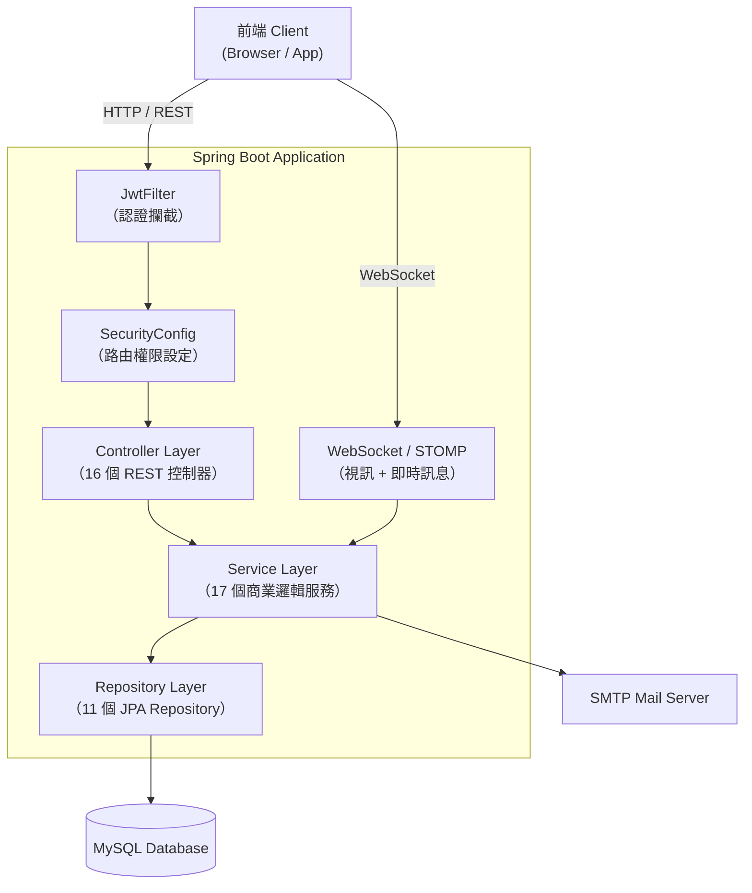
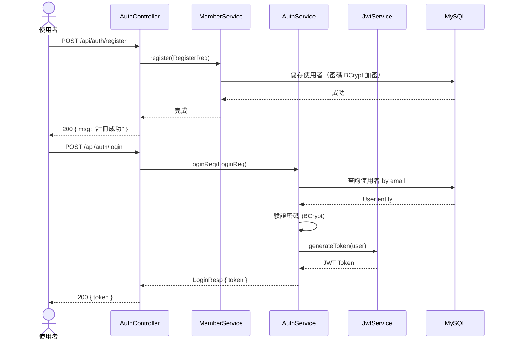
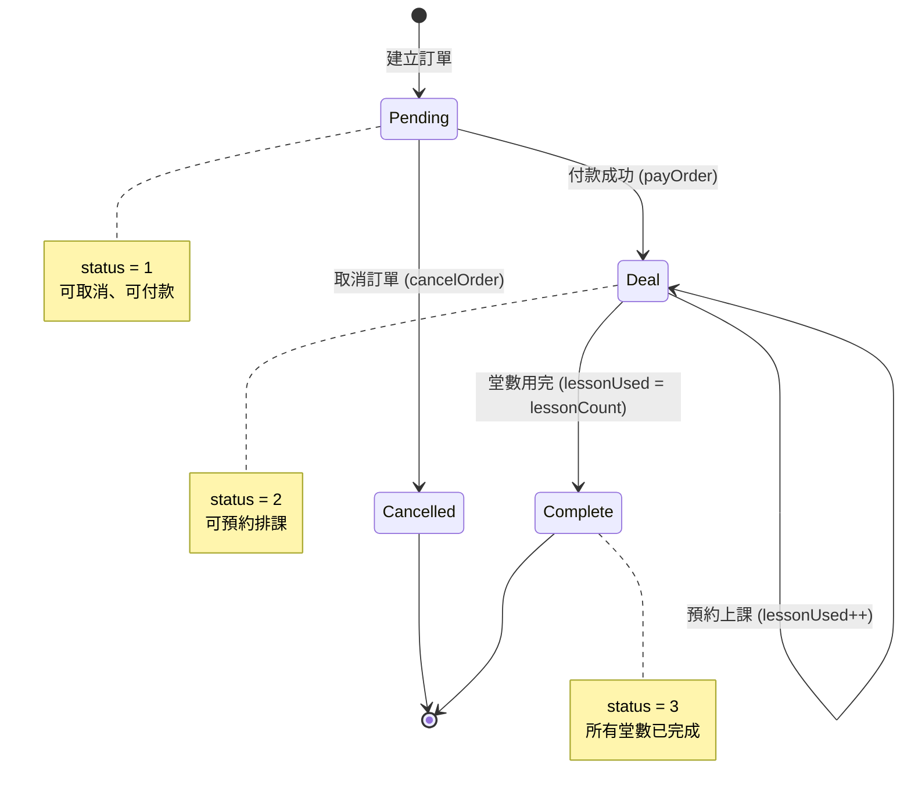
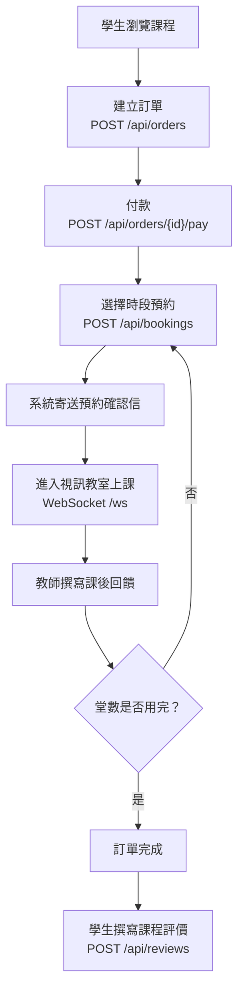
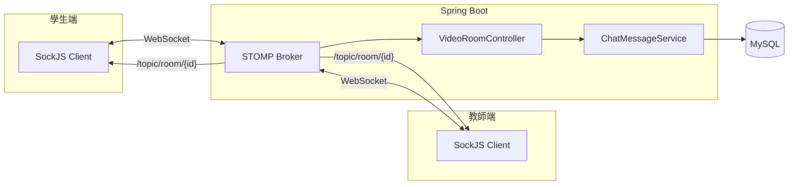
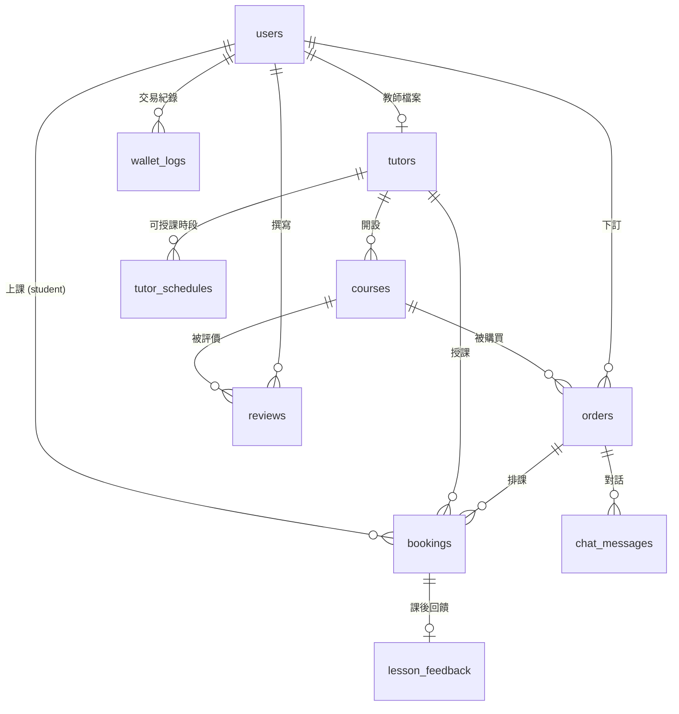

# Learning Platform Backend — 架構概覽說明文件

## 1. 專案簡介

本專案為一套**線上家教學習平台後端 API**，提供學生與教師之間的課程媒合、預約排課、即時通訊與視訊教學等功能。

**技術棧：**

| 項目 | 技術 |
|---|---|
| 語言 | Java 21 |
| 框架 | Spring Boot 4.0.2 |
| 建構工具 | Maven |
| 資料庫 | MySQL 8+ (JPA / Hibernate) |
| 認證授權 | Spring Security + JWT (JJWT 0.11.5) |
| 即時通訊 | WebSocket (STOMP + SockJS) |
| 信件通知 | Spring Mail |
| API 文件 | SpringDoc OpenAPI (Swagger 2.5.0) |
| 監控 | Spring Actuator |
| 程式碼簡化 | Lombok |

---

## 2. 目錄結構說明

```
src/main/java/com/learning/api/
├── annotation/          # 自訂註解（如 @ApiController）
├── config/              # 組態設定
│   ├── MailConfig        # 郵件寄送設定
│   ├── WebSocketConfig   # WebSocket / STOMP 設定
│   ├── WebConfig         # 靜態資源路徑對應（/uploads/** 映射至磁碟目錄）
│   └── TestSecurityConfig# 測試用安全設定
├── controller/          # REST API 控制器（16 個）
├── dto/                 # 資料傳輸物件
│   ├── auth/             # 登入 / 註冊
│   ├── booking/          # 預約相關
│   ├── course/           # 課程相關
│   ├── feedback/         # 回饋相關
│   └── tutor/            # 教師相關
├── entity/              # JPA 實體（10 個資料表對應）
├── enums/               # 列舉型別
├── exception/           # 全域例外處理
├── repo/                # Spring Data JPA Repository
├── security/            # JWT 與安全元件
│   ├── JwtService              # Token 產生 / 解析 / 驗證
│   ├── JwtFilter               # HTTP 請求攔截與驗證
│   ├── SecurityConfig          # Spring Security 過濾鏈、路由授權規則
│   ├── CustomUserDetailsService# 載入 UserDetails（email 查詢）
│   └── SecurityUser            # UserDetails 實作，role int → ROLE_* 字串
└── service/             # 商業邏輯層（17 個服務）
```

---

## 3. 核心模組一覽表

### 3.1 實體模型 (Entity)

| 實體 | 資料表 | 說明 |
|---|---|---|
| `User` | `users` | 使用者帳號（學生/教師/管理員），含錢包餘額 |
| `Tutor` | `tutors` | 教師個人檔案（學歷、證照、自介影片、銀行資訊） |
| `Course` | `courses` | 課程（名稱、科目分類、價格、啟用狀態） |
| `Order` | `orders` | 訂單（單價、折扣價、堂數追蹤、狀態流轉） |
| `Bookings` | `bookings` | 預約排課（日期、時段、鎖定狀態） |
| `Reviews` | `reviews` | 課程評價（專注度、理解力、信心度分數 + 留言） |
| `LessonFeedback` | `lesson_feedback` | 教師課後回饋 |
| `ChatMessage` | `chat_messages` | 訊息（文字/貼圖/語音/圖片/影片） |
| `TutorSchedule` | `tutor_schedules` | 教師可授課時段 |
| `WalletLog` | `wallet_logs` | 錢包交易紀錄 |

### 3.2 控制器 (Controller)

| 控制器 | 路徑前綴 | 功能 |
|---|---|---|
| `AuthController` | `/api/auth` | 註冊、登入（產生 JWT） |
| `TutorController` | `/api/tutor` | 老師（Tutor）資料 CRUD |
| `CourseController` | `/api/courses` | 課程 CRUD |
| `OrderController` | `/api/orders` | 訂單建立 / 修改 / 查詢 / 支付 / 取消 |
| `BookingController` | `/api/bookings` | 預約排課管理 |
| `ReviewController` | `/api/reviews` | 課程評價 CRUD |
| `FeedbackController` | `/api/feedbacks` | 課後回饋 CRUD |
| `ChatMessageController` | `/api/chatMessage` | 聊天訊息（含多媒體） |
| `TeacherController` | `/api/teacher` | 教師課程建立（公開） |
| `CheckoutController` | `/api/shop` | 結帳作業（購買並預約） |
| `TutorProfileController` | `/api/teacher/profile` | 教師個人資料更新 |
| `TutorScheduleController` | `/api/teacher/schedules` | 教師排課時段管理 |
| `TutorFeedbackController` | `/api/teacher/feedbacks` | 教師發送課後回饋 |
| `VideoRoomController` | `/ws` | WebSocket 視訊聊天（WebRTC 信令、即時訊息） |

### 3.3 服務層 (Service)

| 服務 | 職責 |
|---|---|
| `AuthService` | 登入驗證（密碼比對）、JWT 產生 |
| `MemberService` | 會員註冊（email 正規化、BCrypt 密碼雜湊、儲存 User） |
| `UserService` | 使用者帳號操作 |
| `CourseService` | 課程 CRUD、依教師篩選、啟用狀態管理 |
| `OrderService` | 訂單全生命週期（建立→付款→完成→取消） |
| `BookingService` | 預約驗證，委派至 OrderService 扣堂 |
| `ReviewService` | 評價 CRUD、平均分計算 |
| `LessonFeedbackService` | 課後回饋管理 |
| `ChatMessageService` | 訊息儲存與歷史查詢 |
| `TutorService` | 教師檔案查詢 |
| `TutorProfileService` | 教師個人資料更新 |
| `TutorScheduleService` | 教師可授課時段管理 |
| `EmailService` | 信件通知（預約確認、回饋通知等） |
| `PaymentService` | 付款處理 |
| `CheckoutService` | 結帳流程 |
| `TeacherCourseService` | 教師端課程操作 |
| `FileStorageService` | 接受 MultipartFile，UUID 命名後儲存至 `${file.upload-dir}`，回傳 `${file.base-url}/uploads/{uuid}{ext}` URL |

---

## 4. 系統架構圖

### 4.1 分層架構



### 4.2 使用者認證流程



### 4.3 訂單與預約流程



### 4.4 課程購買與上課完整流程



---

## 5. 認證與授權設計

### 5.1 JWT Token 結構

| 欄位 | 值 | 說明 |
|---|---|---|
| `sub` | 使用者 email | 帳號識別（JwtService 以 email 作為 subject） |
| `userId` | User ID | 使用者唯一識別碼（Claim） |
| `role` | 1 / 2 / 3 | 1=學生、2=教師、3=管理員 |
| `iat` | 發放時間 | Token 建立時間 |
| `exp` | 過期時間 | 由 `jwt.exp-minutes` 設定 |

### 5.2 路由權限規則

| 路徑 | 權限 |
|---|---|
| `/api/auth/**` | 公開（無需登入） |
| `GET /api/teacher/**` | 公開（瀏覽教師資料） |
| `GET /api/reviews/**` | 公開（瀏覽評價） |
| `GET /api/chat-messages/**` | 公開 |
| `/api/lesson-feedbacks/**` | 公開 |
| `/uploads/**` | 公開（靜態檔案） |
| `/ws/**` | 公開（WebSocket 連線） |
| `/swagger-ui/**`, `/actuator/**` | 公開（開發工具） |
| `POST/PUT/DELETE /api/teacher/**` | 需 TEACHER 角色 |
| `/test-email/**` | 需 ADMIN 角色 |
| 其他路徑 | 需登入（任意角色） |

---

## 6. 即時通訊架構



**支援的訊息類型：**

| messageType | 說明 |
|---|---|
| 1 | 文字訊息 (TEXT) |
| 2 | 貼圖 (STICKER) |
| 3 | 語音 (VOICE) |
| 4 | 圖片 (IMAGE) |
| 5 | 影片 (VIDEO) |
| 6 | 一般檔案 (FILE)（上傳端點依 MIME type 自動偵測） |

媒體類型（2–6）需透過 `mediaUrl` 傳遞檔案連結；文字類型（1）使用 `message` 欄位。

---

## 7. 資料庫關聯圖



---

## 8. 科目分類編碼

`Course.subject` 欄位使用兩位數整數編碼：

| 編碼 | 類別 | 說明 |
|---|---|---|
| 11 | 年級課程 | 低年級 |
| 12 | 年級課程 | 中年級 |
| 13 | 年級課程 | 高年級 |
| 21 | 檢定與升學 | GEPT |
| 22 | 檢定與升學 | YLE |
| 23 | 檢定與升學 | 國中先修 |
| 31 | 其他 | 其他課程 |

> 編碼規則：十位數代表大類（1=年級、2=檢定、3=其他），個位數代表細項。

---

## 9. 角色與狀態編碼

### 使用者角色 (`User.role`)

| 值 | 角色 |
|---|---|
| 1 | 學生 (Student) |
| 2 | 教師 (Teacher) |
| 3 | 管理員 (Admin) |

### 訂單狀態 (`Order.status`)

| 值 | 狀態 | 可執行操作 |
|---|---|---|
| 1 | Pending（待付款）| 付款、取消 |
| 2 | Deal（進行中）| 預約排課、使用堂數 |
| 3 | Complete（已完成）| 撰寫評價 |

### 教師狀態 (`Tutor.status`)

| 值 | 狀態 |
|---|---|
| 1 | Pending（審核中） |
| 2 | Qualified（已通過） |
| 3 | 停權 |

---

## 10. API 端點總覽

| 方法 | 路徑 | 說明 |
|---|---|---|
| `POST` | `/api/auth/register` | 使用者註冊 |
| `POST` | `/api/auth/login` | 使用者登入，回傳 JWT |
| `GET` | `/api/courses` | 取得課程列表 |
| `POST` | `/api/courses` | 建立課程（教師） |
| `POST` | `/api/orders` | 建立訂單 |
| `POST` | `/api/orders/{id}/pay` | 支付訂單 |
| `PATCH` | `/api/orders/{id}/status` | 更新訂單狀態 |
| `DELETE` | `/api/orders/{id}` | 取消訂單 |
| `GET` | `/api/orders/user/{userId}` | 查詢使用者訂單 |
| `POST` | `/api/bookings` | 預約上課 |
| `GET/POST` | `/api/reviews` | 課程評價 |
| `GET/POST` | `/api/feedbacks` | 課後回饋 |
| `GET/POST/PUT/DELETE` | `/api/chatMessage` | 聊天訊息（文字） |
| `POST` | `/api/chatMessage/upload` | 多媒體檔案上傳（multipart） |
| `POST` | `/api/teacher/feedbacks` | 教師提交課後回饋 |
| `GET/POST/PUT/DELETE` | `/api/teacher/profile` | 教師個人資料管理 |
| — | `/ws/**` | WebSocket 視訊 / 即時訊息 |
| — | `/swagger-ui/index.html` | Swagger API 文件 |
| — | `/actuator/health` | 健康檢查 |

---

## 11. 環境設定

### 開發環境

```properties
# application.properties
spring.datasource.url=jdbc:mysql://localhost:3306/learning
spring.jpa.hibernate.ddl-auto=update
jwt.secret=<your-secret-key>
jwt.exp-minutes=60
server.port=8080
file.upload-dir=./uploads
file.base-url=http://localhost:8080
```

### 生產環境

```properties
# application-prod.properties
# 所有敏感設定透過環境變數注入
spring.jpa.hibernate.ddl-auto=validate
spring.jpa.show-sql=false
```

啟動指令：
```bash
# 開發
./mvnw spring-boot:run

# 生產
java -jar target/api-0.0.1-SNAPSHOT.jar --spring.profiles.active=prod
```

---

*本文件由程式碼分析自動產出，反映 `feature/Review` 分支截至 2026-03-16 的架構現況。*
